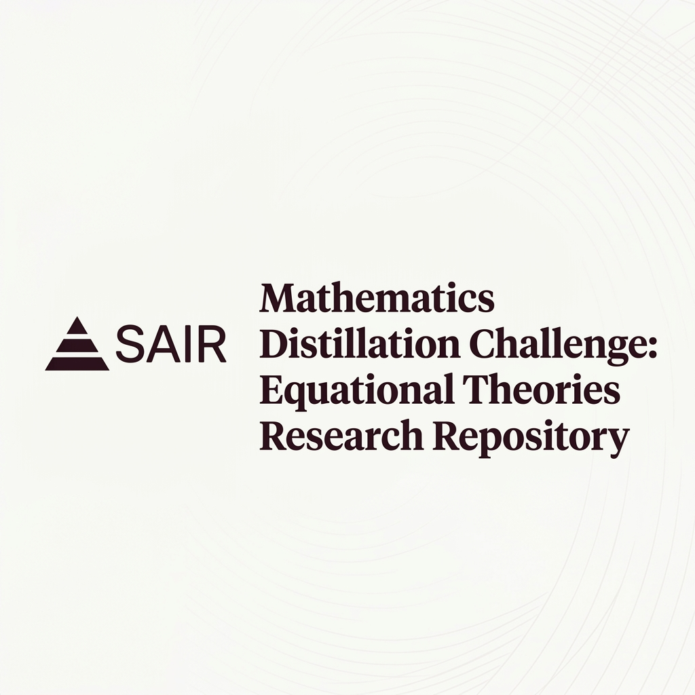

# SAIR Mathematics Distillation Challenge

**Prepared by**: Amey Thakur

Welcome to the long-term research repository for the SAIR Mathematics Distillation Challenge. This repository contains all research, analysis, source codes, and submission artifacts for both Stage 1 and Stage 2 of the competition.

## Repository Architecture

The repository is structured to separate the completed Phase 1 work from ongoing Phase 2 research.

### [Stage 1: Knowledge Distillation](./stage1/)
Stage 1 focused on human-readable heuristics, prompt engineering, and producing concise cheatsheets.
*   **[prompts/](./stage1/prompts/)**: Canonical prompt templates for Stage 1.
*   **[cheatsheets/](./stage1/cheatsheets/)**: Distilled knowledge artifacts (e.g., magma cheatsheet).
*   **[analysis/](./stage1/analysis/)**: Technical analysis of magma theories and problem subsets.
*   **[scripts/](./stage1/scripts/)**: Python tools for data profiling and analytics.
*   **[sources/](./stage1/sources/)**: Raw source data and external dependencies (including Lean 4 source repos).

### [Stage 2: Formal Verification & Deterministic Solvers](./stage2/)
Stage 2 transitions into automated theorem proving, counterexample generation, and Lean 4 verification.
*   **[architecture.md](./stage2/architecture.md)**: System architecture for the solver.
*   **[research.md](./stage2/research.md)**: Research report detailing judge interaction, Lean verification, and budget optimization.
*   *Other directories in `stage2/` (e.g., `solver/`, `lean/`, `judge/`) are placeholders for active development.*

