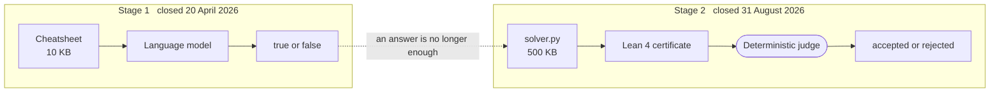
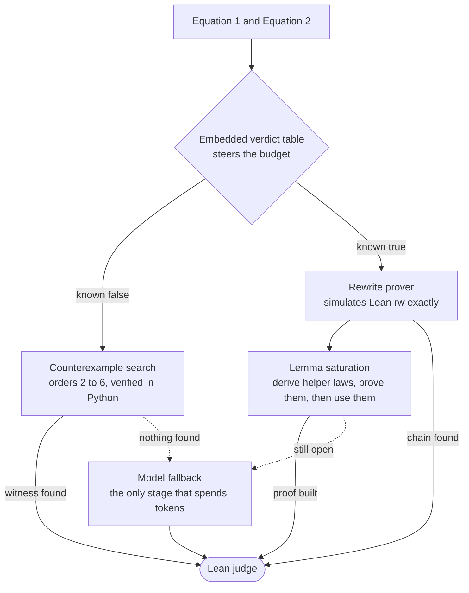

<div align="center">

<a href="https://competition.sair.foundation/competitions/mathematics-distillation-challenge-equational-theories-stage2/overview" title="SAIR Foundation, open the competition"></a>

# Mathematics Distillation Challenge

**Equational Theories, Stage 1 and Stage 2, worked end to end.**

<br>

Can mathematical reasoning be compressed into a page a language model reads
before it answers? And can that answer be made to carry a proof a machine will
check, rather than a claim a person has to trust?

<br>

[Stage 1](stage1/README.md) &nbsp;·&nbsp;
[Stage 2](stage2/README.md) &nbsp;·&nbsp;
[Solvers](stage2/solvers/README.md) &nbsp;·&nbsp;
[Competition](https://competition.sair.foundation/competitions/mathematics-distillation-challenge-equational-theories-stage2/overview) &nbsp;·&nbsp;
[Discussions](https://github.com/Amey-Thakur/SAIR-MATHEMATICS-DISTILLATION-CHALLENGE/discussions)

<br>

[](LICENSE)
[](https://competition.sair.foundation/competitions/mathematics-distillation-challenge-equational-theories-stage2/overview)
[](https://competition.sair.foundation/competitions/mathematics-distillation-challenge-equational-theories-stage2/overview)
[](https://lean-lang.org/)
[](https://github.com/Amey-Thakur)

<br>

<a href="https://github.com/Amey-Thakur" title="Amey Thakur on GitHub"></a>

<br>

<a href="https://github.com/Amey-Thakur" title="Amey Thakur on GitHub"></a>

</div>

---

<br>

## The problem

A **magma** is the least structured object in algebra: a set with one binary
operation `◇` and nothing else. No associativity, no identity, no inverses.
Because so little is assumed, a law such as `x = x ◇ y` constrains a magma only
lightly, and working out what else it forces is genuinely difficult.

The [Equational Theories Project](https://github.com/teorth/equational_theories)
took the 4,694 simplest such laws and asked, for every ordered pair, whether
the first implies the second. That is 22,033,636 questions, settled in Lean 4
through a mix of automated search and human proof.

This competition asks a different question about the same material.

> Can strong mathematical reasoning be distilled into a compact artefact that
> makes a language model better at a formal task?

The setup follows Honda, Murakami and Zhang (2025), *Distilling Many-Shot
In-Context Learning into a Cheat Sheet*. The difference here is that the
artefact is discovered by open competition rather than produced by a single
model query.

Organised by **Damek Davis** (Associate Professor of Statistics and Data
Science, University of Pennsylvania), **Terence Tao** (Professor at UCLA and
co-founder of the SAIR Foundation), and the SAIR Foundation.

> [!NOTE]
> Stage 1 launched on 14 March 2026 at 15:09:26 UTC+14, the earliest place on
> Earth to reach the time 3.1415926.

<br>

## The two stages


```mermaid
flowchart LR
    subgraph S1["Stage 1 &nbsp; closed 20 April 2026"]
        A["Cheatsheet<br>10 KB"] --> B["Language model"]
        B --> C["true or false"]
    end
    subgraph S2["Stage 2 &nbsp; closed 31 August 2026"]
        D["solver.py<br>500 KB"] --> E["Lean 4 certificate"]
        E --> F(["Deterministic judge"])
        F --> G["accepted or rejected"]
    end
    C -.->|"an answer is no longer enough"| D
```

Stage 1 rewards a confident answer, so a model that is fluent and wrong scores
the same as one that is careful and wrong. Stage 2 removes that: an answer is
worth nothing unless it arrives with a certificate.

<br>

## Stage 1: the cheatsheet

Submit a **complete prompt**, the template and the cheatsheet text together, at
most 10 KB, exactly as it will be sent. The model answers true or false, and
only correctness is scored.

| Constraint | Value |
| :--- | :--- |
| Cheatsheet size | 10 KB, template and text together |
| Evaluation set | Balanced, half true and half false, held back from the public problems |
| Setting | Offline. No browser, no search, no retrieval |
| Models | GPT-OSS-120B, Llama-3.3-70B-Instruct, Gemma-4-31B-IT, equal weight |
| Public problems | 1,669 across `normal`, `hard1`, `hard2`, `hard3` |

> [!IMPORTANT]
> A balanced set is the detail that decides everything. A model that answers
> the same way every time lands on 50 per cent accuracy and looks
> half-competent, so accuracy on its own cannot tell a reasoner from a coin.
> One of the three evaluation models did exactly that, scoring an F1 near zero
> while parsing every prompt correctly.

Full scores, and what each model actually did, are in
**[stage1/](stage1/README.md)**.

<br>

## Stage 2: the certificate

Submit a **solver**: one `solver.py`, at most 500 KB, which for each pair of
equations produces a Lean 4 certificate.

| Verdict | What has to be produced |
| :--- | :--- |
| **True** | A Lean 4 proof that the hypothesis forces the goal in every magma |
| **False** | A magma where the hypothesis holds and the goal fails, as a term the judge evaluates |

A deterministic Lean judge accepts or rejects. There is no partial credit.

Two tracks share that one file.

| Track | Shape | Budget |
| :--- | :--- | :--- |
| **Solo** | One problem per subprocess, JSON over stdin and stdout, judge feedback between attempts | Fixed, per problem |
| **Marathon** | N problems per subprocess, reference N = 100, manifest in, append-only JSONL out | Shared: N × 5 minutes and N × 32,768 tokens |

> [!WARNING]
> The evaluation sandbox is `python:3.12-slim` with **no third-party packages
> and no network**. A solver that imports `numpy` does not run slowly or answer
> badly. It dies on import, before the first problem, and every answer is lost.
> Nothing in a local run reveals this, because the packages are installed
> locally. It is checked in CI instead.

<br>

## How this repository answers it

The obvious solver asks a model to write the Lean proof and hopes the judge
agrees. Model-written Lean is wrong often enough that a large share of answers
come back rejected, and every one of them has already been paid for in tokens.

The solver here inverts the order. It proves what it can without the model, and
each deterministic answer is correct before it is ever sent.


```mermaid
flowchart TD
    P["Equation 1 and Equation 2"] --> V{"Embedded verdict table<br>steers the budget"}

    V -->|"known false"| C["Counterexample search<br>orders 2 to 6, verified in Python"]
    V -->|"known true"| R["Rewrite prover<br>simulates Lean rw exactly"]

    R --> L["Lemma saturation<br>derive helper laws, prove them, then use them"]

    C -->|"witness found"| J(["Lean judge"])
    R -->|"chain found"| J
    L -->|"proof built"| J

    C -.->|"nothing found"| M["Model fallback<br>the only stage that spends tokens"]
    L -.->|"still open"| M
    M --> J
```

Four properties make it work, and each one answers something that went wrong
first.

**Counterexamples are cheap and certain.** Orders 2 and 3 exhaustively, affine
magmas up to order 8, order 4 by constrained backtracking, and filtered random
tables at orders 5 and 6. Every witness is verified in Python before it is
emitted, so the judge only confirms a fact already established.

**Some true implications need no model either.** If the hypothesis forces every
element equal, one line closes any goal. Beyond that, a rewrite prover
simulates Lean's `rw` exactly and searches short chains of hypothesis instances
in both directions, and a lemma saturation pass derives helper laws and proves
them before using them.

**The verdict is known before the search starts.** The Equational Theories
outcome matrix is embedded in the solver, compressed to about 32 KB by
collapsing 4,694 equations into 1,415 classes with identical implication
behaviour.

**The model is the last resort.** It is called only for true implications that
resisted every deterministic stage, with a structural prompt and a ban list
applied to whatever comes back.

> [!TIP]
> The verdict table steers the budget and nothing else. A table miss, or an
> entry that disagrees with reality, can never produce a wrong answer, because
> every certificate is still verified locally before it is sent.

On the official 20-problem sample the deterministic stages alone answer 15,
with no tokens spent and no incorrect certificate produced.

<br>

## What is where

| Path | What it holds |
| :--- | :--- |
| **[stage1/](stage1/README.md)** | The cheatsheet stage: prompt, cheatsheet, problem-set analysis, scoring scripts, source datasets |
| **[stage2/](stage2/README.md)** | The certificate stage: architecture, research notes, and the sandbox gate |
| **[stage2/solvers/](stage2/solvers/README.md)** | The three solvers, which one was submitted, and how to test against the real judge |
| [stage1/analysis/](stage1/analysis/) | What the problem sets contain and how the models fail on them |
| [stage1/sources/](stage1/sources/) | The Equational Theories Project, the benchmark, and the selected problem sets, at the revision used |
| [.github/workflows/](.github/workflows/) | The CI gate that holds the solver to the sandbox rules |

<br>

## Reproduce it

The Lean judge is the only authority on whether a certificate is accepted, so
test against the official harness.

```bash
git clone https://github.com/SAIRcompetition/equational-theories-lean-stage2
cd equational-theories-lean-stage2
bash scripts/setup.sh
source .env.judge
python3 -m pipeline.runner --submission <this-repo>/stage2/solvers/hybrid --problems examples/problems/sample_20.json
```

Two checks run with no Lean toolchain at all. The first holds the solver to the
sandbox rules and the size cap, the second re-parses every emitted certificate
from its Lean source and re-verifies it.

```bash
python stage2/scripts/check_solver.py
python stage2/solvers/hybrid/verify_solver.py
```

<br>

## Reading further

- [Equational Theories Project](https://github.com/teorth/equational_theories), the Lean formalisation this is built on
- [Official Stage 2 pipeline](https://github.com/SAIRcompetition/equational-theories-lean-stage2), judge, demo solvers and tutorial
- [Stage 1 judge](https://github.com/SAIRcompetition/equational-theories-stage1-judge), evaluation configuration and local testing
- [Selected problems](https://huggingface.co/datasets/SAIRfoundation/equational-theories-selected-problems), the public sets on Hugging Face

<br>

---

<div align="center">

**[SAIR Foundation competitions index](https://github.com/Amey-Thakur/SAIR-FOUNDATION-INDEX)**

Every SAIR challenge, what each one asks, the dates that govern it, and where
the work lives.

<br>

Prepared by **[Amey Thakur](https://github.com/Amey-Thakur)** &nbsp;·&nbsp;
ORCID [0000-0001-5644-1575](https://orcid.org/0000-0001-5644-1575) &nbsp;·&nbsp;
SAIR [ID 25789315](https://sair.foundation/u/25789315)

<sub>Released under <a href="LICENSE">CC BY 4.0</a>, with citation metadata in <a href="CITATION.cff">CITATION.cff</a>.<br>
Material under <code>stage1/sources/</code> belongs to its original authors and keeps its own licence.</sub>

</div>
