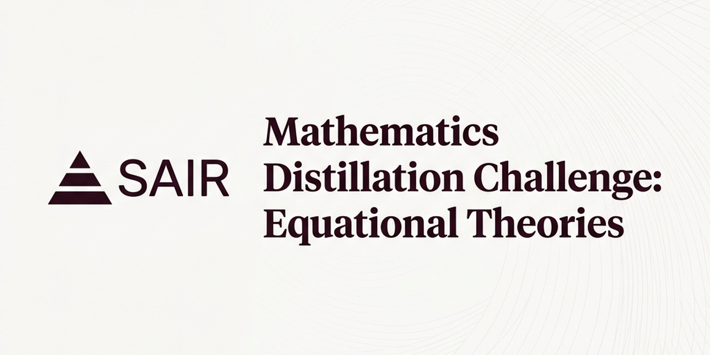

# Stage 1: Knowledge Distillation

All work from Stage 1 of the SAIR Mathematics Distillation Challenge is preserved here.

## What Stage 1 Was

Stage 1 asked participants to build a prompt (template + cheatsheet, max 10 KB) that helps LLMs determine whether one magma equation implies another. The model returns True or False. No formal proofs, no counterexamples, just classification.

Team AVATAR (EQT01-T00899) scored 2,889 (Rank 235). The organizer baseline scored 2,853. Breakdown:

| Model | Problem Set | Accuracy | F1 | Parse Rate | Cost |
|-------|------------|----------|-----|-----------|------|
| Gemma 4 31B IT | normal | 68.3% | 66.3% | 100.0% | $0.00059 |
| GPT-OSS 120B | normal | 61.0% | 64.4% | 100.0% | $0.00027 |
| Llama 3.3 70B | normal | 50.2% | 1.3% | 100.0% | $0.00031 |
| Gemma 4 31B IT | hard | 54.3% | 60.1% | 100.0% | $0.00057 |
| GPT-OSS 120B | hard | 50.5% | 56.5% | 100.0% | $0.00030 |
| Llama 3.3 70B | hard | 49.7% | 0.0% | 100.0% | $0.00031 |
| Gemma 4 31B IT | extra_hard | 44.5% | 56.5% | 100.0% | $0.00067 |
| GPT-OSS 120B | extra_hard | 53.2% | 64.1% | 100.0% | $0.00031 |
| Llama 3.3 70B | extra_hard | 49.8% | 0.0% | 100.0% | $0.00031 |

Key takeaway: Llama 3.3 70B produced near-zero F1 across all sets. It parsed correctly (100% parse rate) but could not reason about equational implications. Gemma did best on normal difficulty. GPT-OSS was stronger on extra_hard.

## Directory Layout

- **`prompts/`**: The `complete_prompt.template` and prompt engineering artifacts used to query models.
- **`cheatsheets/`**: Distilled knowledge files, primarily `magma_cheatsheet.md`, tuned for the 10 KB token limit.
- **`analysis/`**: Technical audits of Stage 1 problem subsets and magma theory (`research.md`, `problem_analysis.md`).
- **`scripts/`**: Python tools (`profile_datasets.py`, `process_runs.py`) for profiling data and mining model performance metrics.
- **`sources/`**: Raw source data, including the ETP (Equational Theories Project) repository clone and SAIR subsets.
