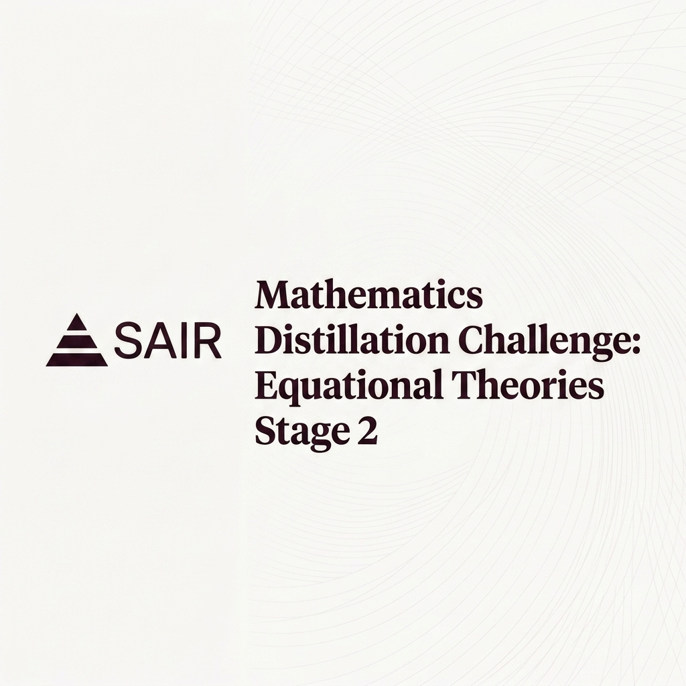

# Stage 2: Formal Verification & Deterministic Solvers

Welcome to the Stage 2 active research and development workspace for the SAIR Mathematics Distillation Challenge.

## Stage 2 Overview
Stage 2 fundamentally changes the requirements from Stage 1. Instead of simply asserting whether an implication is true or false, the solver must produce mathematically rigorous, machine-verifiable proof certificates using Lean 4. If an implication is false, the solver must produce a finite magma counterexample.

## Workspace Layout
*   **`architecture.md`**: Defines the system architecture, specifically the hybrid LLM/Deterministic pipeline.
*   **`research.md`**: Contains an in-depth analysis of the competition mechanics, evaluation judge, Lean 4 toolchains, and strategies.
*   **`solver/`**: [Placeholder] Will contain the core Python orchestrator that manages the AST parsing and execution path.
*   **`lean/`**: [Placeholder] Will contain Lean 4 environments, templates, and testing harnesses.
*   **`proxy/`**: [Placeholder] Will contain the proxy server for routing and caching LLM requests (e.g., OpenRouter).
*   **`judge/`**: [Placeholder] Will contain the local implementation of the SAIR deterministic judge for pre-submission validation.
*   **`experiments/`**: [Placeholder] Will hold notebooks and scratchpads for prompt and algorithm experimentation.
*   **`scripts/`**: [Placeholder] Utility scripts for building, testing, and interacting with the challenge API.

## Roadmap
1. Establish local evaluation environment (Lean 4 and Judge).
2. Develop the high-speed deterministic counterexample generator.
3. Build the LLM proxy and prompt pipeline for proof synthesis.
4. Integrate the pipeline into a single automated solver.
